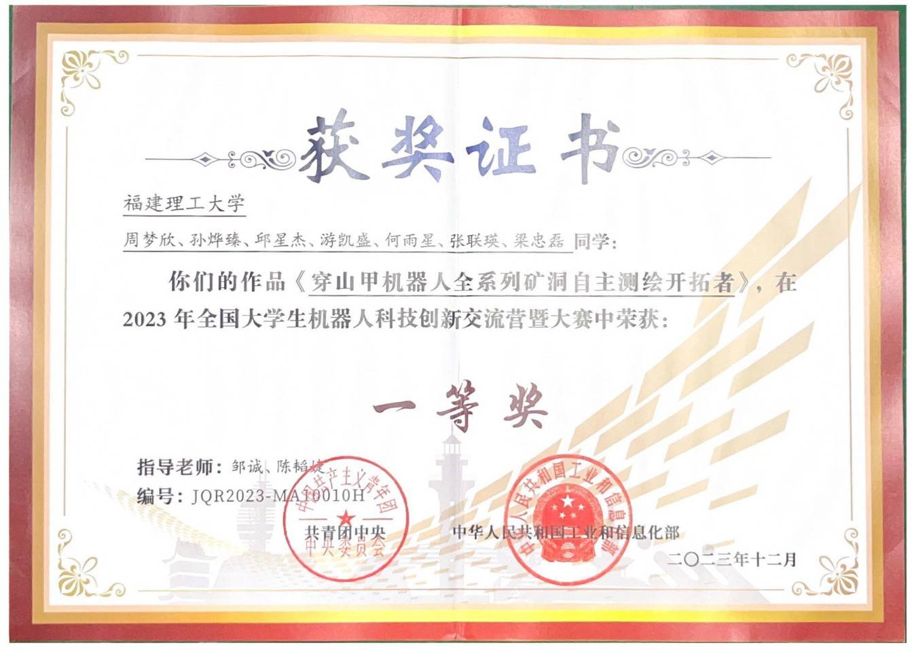
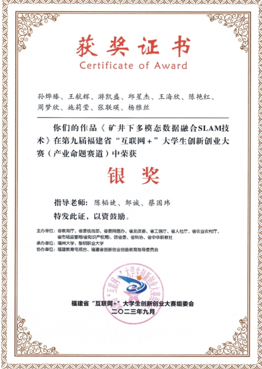
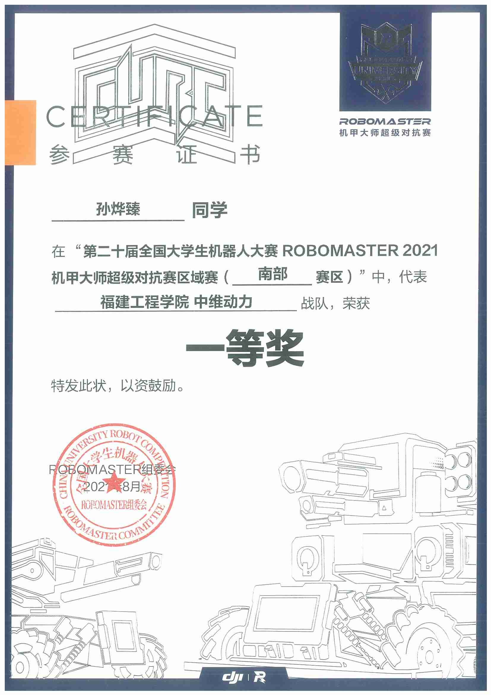
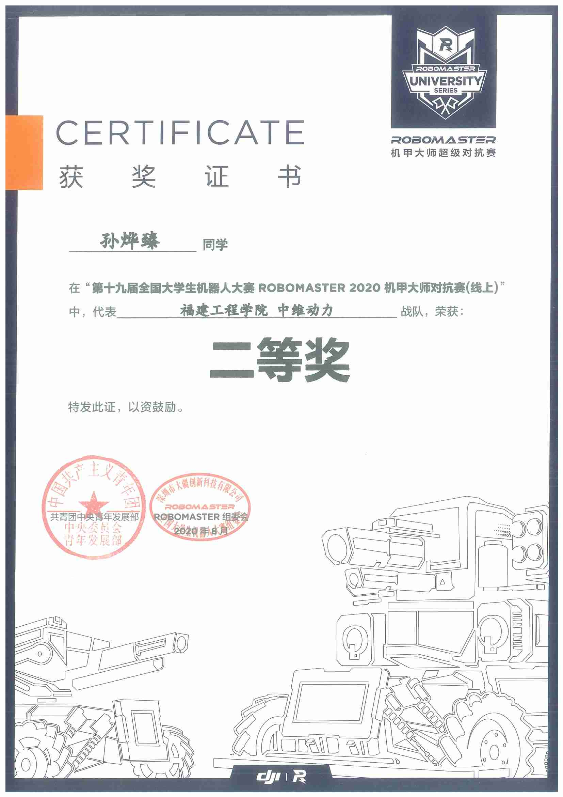
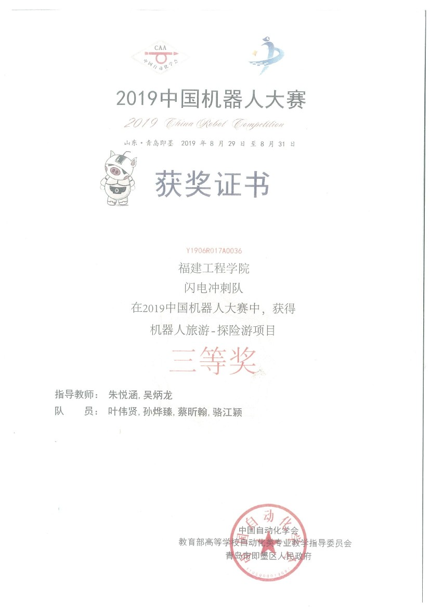
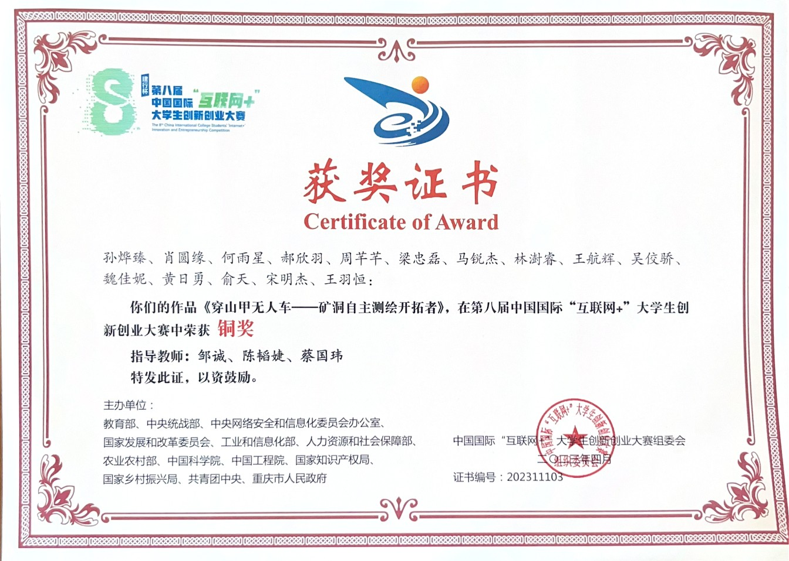
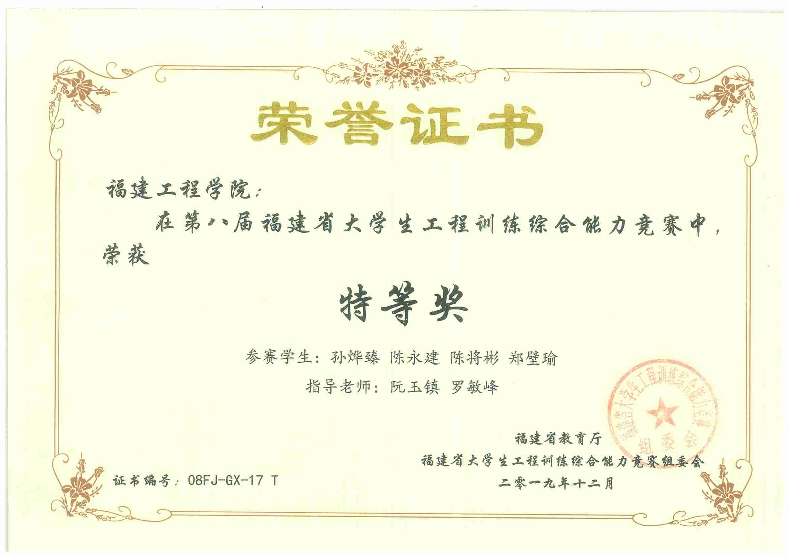
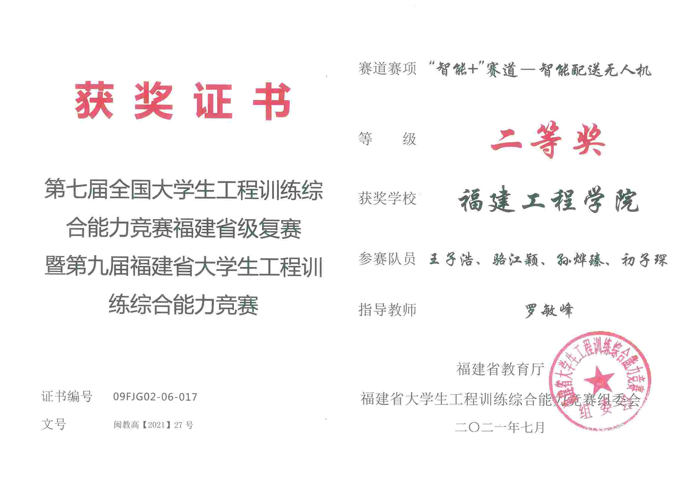
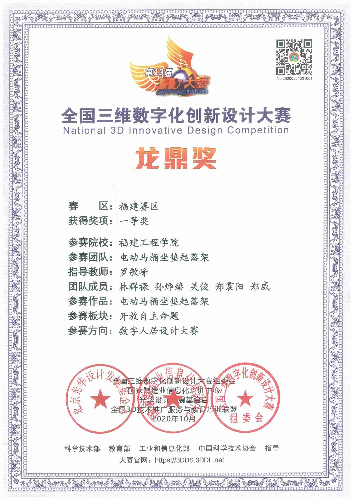
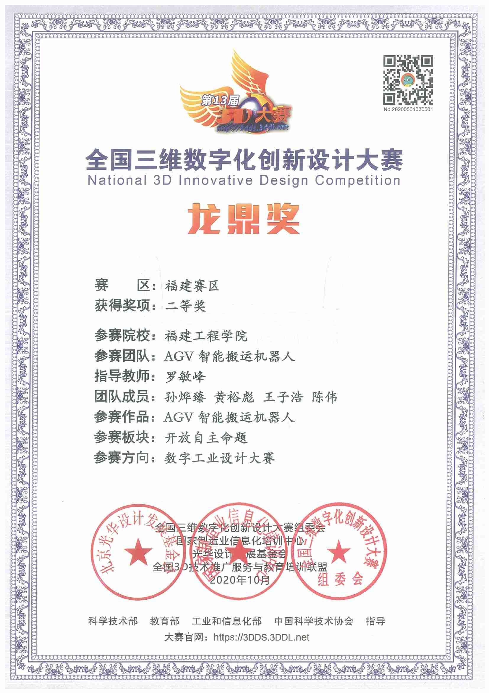



<!--  -->

研究生期间比赛项目 Graduate competitions
======

  

    
    
全国大学生机器人科技创新交流营暨大赛（全国一等奖）   

  

  

    
    
第九届福建省“互联网+”大学生创新创业大赛--矿井下多模态数据融合SLAM技术（福建省产业赛道银奖）

  

本科期间比赛项目 Undergraduate competitions
======

  

    
    
第二十届全国大学生机器人人大赛RoboMaster南部赛区（一等奖）

  

  
  

    
    
第十九届全国大学生机器人人大赛RoboMaster（全国二等奖）

  

  

    
    
ROBOCUP中国大学生机器人人大赛（国家三等奖）

  

  

    
    
第八届大学生互联网+创新创业大赛（国家铜奖）

  

  

    
    
第八届福建省大学生工程训练综合能力竞赛（福建特等奖）

  

  

    
    
第七届全国大学生工程训练综合能力竞赛暨第九届福建省大学生工程训练综合能力竞赛（福建省二等奖）

  

  

    
    
全国大学生三维数字化创新设计大赛（福建赛区一等奖）

  
  
  
  

    
    
全国大学生三维数字化创新设计大赛（福建赛区二等奖）

  

